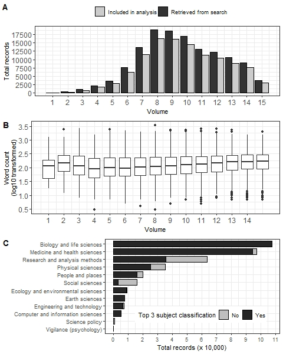

```{r setup, include=FALSE}
knitr::opts_chunk$set(echo = FALSE)
library(tidyverse)
library(ggpubr)
library(knitr)
library(flextable)
library(tidytext)

g.theme = theme_bw()+theme(legend.position = 'top',legend.direction = 'horizontal')
```

# Introduction

An ideal statistical analysis will use appropriate methods to create insights from the data and inform the research questions. Unfortunately many current statistical analyses are far from ideal, with many researchers using the wrong methods, misinterpreting the results, or failing to adequately check their assumptions [@2008;@Leek2017]. Some researchers take a "mechanistic" approach to statistics, copying the few methods they know regardless of their appropriateness, and then going through the motions of the analysis [@Stark2018]. 

Many researchers lack adequate training in research methods, and statistics is something they do with trepidation and even ignorance [@Altman1994;@King2019]. 
However, using the wrong statistical methods can cause real harm [@Altman1994;@Brown2018] and bad statistical practices are being to used abet weak science [@Stark2018].
Statistical mistakes are a key source of waste in research and partly explain the current reproducibility crisis in science [@Allison2016]. Even when the correct methods are used, many researchers fail to describe them adequately, making it difficult to reproduce the results [@Ernst2017;@Zhou2018].
Poor statistical methods might not be caught by reviewers, as they may not be qualified to judge the statistics.
A recent survey of editors found that only 23% of health and medical journals used expert statistical review for all articles [@Hardwicke2020], which was little different from a survey from 22 years ago [@Goodman1998].

There is guidance for researchers on how to write up their statistical methods and results.
The International Committee of Medical Journal Editors recommend that researchers should: “Describe statistical methods with enough detail to enable a knowledgeable reader with access to the original data to judge its appropriateness for the study and to verify the reported results” [@ICMJE2019]. 
More detailed guideance is given by the SAMPL and EQUATOR guidelines [@Lang2013;@Altman2016] with the latter covering all apsects of the paper. Both of these guidelines were led by Doug Altman, who spoke often and for many years about the need for better statistical reporting. 
The awareness and use of these guidelines could be improved. There were 256 Google Scholar citations to the SAMPL paper (as at 15 March 2021) which is a good citation statistic for most papers, but is low considering the millions of papers that use statistical analysis.
<!--- Although the general lack of statistical understanding from both authors and reviewers means this recommendation may not be checked. --->

Two statisticians on this paper (AB and NW) have heard researchers admit that they have copied-and-pasted their statistical methods sections from other papers, regardless of whether they are appropriate. 
The aim of this paper is to use text-mining methods to estimate the extent that researchers are using cut-and-paste or 'boilerplate' statistical methods sections.
Boilerplate text is that "which can be reused in new contexts or applications without significant changes to the original" [@Wikipedia].
Use of these methods sections indicates that little thought has gone into the statistical analysis.


# Methods

\subsection{Data sources}

We used two openly available data sources to find statistical methods sections, covering peer-reviewed journal articles and registered clinical trial protocols.

\subsubsection{Public Library of Science (PLOS ONE)}
\label{sec:methodsPLOS}

_PLOS ONE_ is a large open access journal that publishes original research across a wide range of scientific fields. Articles must be in English. Article submissions are handled by an academic editor who selects peer reviewers based on their self-nominated areas of expertise. Submissions do not undergo formal statistical review. Instead, reviewers are required to assess submissions against several publication criteria, including whether: “Experiments, statistics, and other analyses are performed to a high technical standard and are described in sufficient detail” [@PLOS]. All reviewers are asked the question: "Has the statistical analysis been performed appropriately and rigorously?", with the possible responses of "Yes", "No" and "I don't know".

Authors are encouraged to follow published reporting guidelines such as EQUATOR, to ensure that chosen statistical methods are appropriate for the study design, and adequate details are provided to enable independent replication of results. 

All _PLOS ONE_ articles are freely accessible via the PLOS Application Programming Interface (API). This enabled us to conduct semi-automated searches of full-text articles and analyse data on individual records, including text content and general attributes such as publication date and field(s) of research. To find papers with a statistical methods section we used targeted API searches followed by article filtering based on section headings. The data were downloaded on 3 July 2020.

_Step 1_: Targeted API searches. API searches were completed using the R package ‘rplos’ [@rplos]. Search queries targeted the presence of analysis-related terms anywhere in the article. Search terms combined the words “data” or “statistical” with one of: “analysis”, “analyses”, “method”, “methodology” or “model(l)ing”. Search terms were intended to be broad whilst keeping search results to a manageable number for full-text review (see Step 2). By allowing terms to appear anywhere in the article, we accounted for the possibility of relevant text being placed in different sections, for example, in the _Material and Methods_ section versus _Results_. Search results were indexed by a unique Digital Object Identifier (DOI). Attribute data collected per DOI included journal volume and subject classification(s).

_Step 2_: Partial matching on section headings. Full text XML data for all search results were downloaded and combined into a single dataset, organised by DOI and subsection heading(s). Since _PLOS ONE_ does not prescribe standardised headings to preface statistical methods sections, we performed partial matching on available headings agai

\subsubsection{Australia and New Zealand Clinical Trials Registry (ANZCTR)}
\label{sec:methodsANZCTR}

The ANZCTR was established in 2005 as part of a coordinated global effort to improve research quality and transparency in clinical trials reporting; observational studies can also be registered. All studies registered on ANZCTR are publicly available and can be searched via an online portal (https://www.anzctr.org.au). 
<!--- Researchers responsible for overseeing a clinical trial are expected to register full details before commencing participant enrolment. --->
Details required for registration follow a standardised template [@ANZCTR], which covers participant eligibility, the intervention(s) being evaluated, study design and outcomes. The information provided must be in English. Studies are not peer reviewed. 

For the statistical methods section, researchers are asked to provide a "brief description" of the sample size calculations, statistical methods and planned analyses, although this section is not compulsory [@ANZCTR]. Studies are reviewed by ANZCTR staff for completeness of key information, which does not include the completeness of the statistical methods sections. 

All studies available on ANZCTR were downloaded on 1 February 2020 in XML format. 
We used all the text available in the "Statistical methods" section. We also collated basic information about the study including the study type (interventional or observational), submission date, number of funders and target sample size. These variables were chosen as we believed they might influence the completeness of the statistical methods section, because we expected larger studies and those with funding to be more complete, and we also were interested in changes over time.

Studies prior to 2013 were excluded as the statistical methods section appeared to be introduced in 2013.
Some studies were first registered on the alternative trial database _clinicaltrials.gov_ and then also posted to ANZCTR. We excluded these studies because they almost all had no completed statistical methods section as this section is not included in _clinicaltrials.gov_.

\subsection{Full-text processing}
\label{sec:methods-cleaning}

We applied the same text cleaning to both data sources. 
Text cleaning aimed to standardise notation and statistical terminology, whilst minimising changes to article style and formatting. _R_ code used for data extraction and cleaning is available from https://github.com/agbarnett/stats_section.

Mathematical notation including Greek letters was converted from Unicode characters to plain text. For example, the Unicode characters corresponding to $\theta$ (<U+03B8>) were replaced with ‘theta’. Similarly, common symbols outside of Unicode blocks including ‘%’ (percent) and ‘<’ (‘less-than’) were converted into plain text using the ‘textclean’ package [@textclean]. General formatting was removed, this included carriage returns, punctuation marks, in-text references (e.g. "[42]") centred equations, and other non-ASCII characters. Text contained inside brackets was retained to maximise content for analysis, with brackets removed.

We compiled an extensive list of statistical terms to standardise descriptions of statistical methods reported across both datasets. An initial list was compiled by calculating individual word frequencies and identifying relevant terms that appeared at least 100 times. Further terms were sourced from index searches of three statistics textbooks [@Dobson2018,@Diggle2013,@Bland2015]. The final list is provided as Supplementary Material. Plurals (e.g., ‘chi-squares’) unhyphenated (e.g., ‘chi square’) and combined (e.g. ‘chisquare’) terms were transformed to singular, hyphenated form (e.g., ‘chi-square’). Common statistical tests were also hyphenated (e.g., ‘hosmer lemeshow’ to ‘hosmer-lemeshow’).

As a final step, common stop words including pronouns, contractions and selected prepositions were removed. We retained selected stop words that, if excluded, may have changed the context of statistical methods being described, for example ‘between’ and ‘against’.

<!-- Questions: -->

<!-- * Reference updates to stats reporting guidelines; e.g see: -->

<!-- - https://everyone.plos.org/2019/09/26/new-plos-one-statistical-reporting-guidelines/. -->
<!-- - https://web.archive.org/web/20190607174803/https://journals.plos.org/plosone/s/submission-guidelines -->
<!-- - https://web.archive.org/web/20150507175314/https://journals.plos.org/plosone/s/submission-guidelines -->

nst frequently used terms in initial search results: ‘Statistical analysis’, ‘Statistical analyses’, ‘Statistical method’, ‘Statistics’, ‘Data analysis’ and ‘Data analyses’. To determine the reliability of our chosen filters, we manually reviewed full text data extracted for a random sample of XXX articles that were not matched (File S1).[TODO…finish this thought…]

\subsection{Clustering algorithm}

_Details to come_

Results were transformed to lower case for the clustering, but examples are given using the original capitalisation.

\subsection{Missing statistical methods sections}

The statistical methods section for the ANZCTR data was missing for some studies and we examined if there were particular studies where this section was more likely to be missing. 
We used four independent variables of date, study type (observational or interventional), number of funders and target sample size. 
We used a logistic regression model fitted using a Bayesian paradigm. A small number of sections were labelled as "Not applicable", "Nil" or "None" and we changed these to missing. 


# Results

## _PLOS ONE_

```{r}
load('../total.records.plos.rda')
n.api = total.records[[1]] %>% filter(stage=='API') %>% pull(n) %>% sum()
n.include = total.records[[1]] %>% filter(stage=='Included in analysis') %>% pull(n) %>% sum()
perc.include = round(100*n.include/n.api)
min.perc.stats = total.records[[2]] %>% filter(percentage==min(percentage)) %>% select(volume,percentage)
max.perc.stats = total.records[[2]] %>% filter(percentage==max(percentage)) %>% select(volume,percentage)
```

```{r}
load('../wordcount.plos.rda')
n.words = wordcounts %>% summarise(med = median(words),q1=quantile(words,.25),q3=quantile(words,.75))
p.extremes = wordcounts %>% summarise(morethan500 = round(100*mean(words>500)),lessthan50=round(100*mean(words<50)))
n.extremes = wordcounts %>% summarise(morethan500 = sum(words>500),lessthan50=sum(words<50))
```



```{r,fig.height=12,fig.width=6,fig.asp=0.6,fig.cap='\\label{fig:plos-n}Search results by _PLOS ONE_ volume (1st row); word count per statistical methods section included in analysis (n = 111,731; 2nd row); subject classifications assigned to full-text records included in analysis (3rd row)'}

load('../stats_section_subject.classifications.rda')
stats_section_subject = mutate(stats_section_subject,
                               top3 = ifelse(subject_level_number %in% 1:3,1,0))

to_plot = stats_section_subject %>% group_by(subject_level_name) %>% summarise(n=n(),Yes=sum(top3),No=sum(top3==0),.groups='drop')

n.top3 = to_plot %>% filter(n==Yes)
n.biology = to_plot %>% filter(subject_level_name=='Biology and life sciences') %>% pull(n)
n.earth = to_plot %>% filter(subject_level_name=='Earth sciences') %>% pull(n)
n.computer = to_plot %>% filter(subject_level_name=='Computer and information sciences') %>% pull(n)

```


API searches returned `r format(n.api,big.mark=',')` unique records, of which `r format(n.include,big.mark=',')` (`r perc.include`%) included a statistical methods section based on our search criteria. In the final sample, 95,518 (85%) DOIs returned an exact match against common section headings, including 64,133 for 'statistical analysis', 13,380 for 'statistical analyses' and 13,627 for 'data analysis'. Among DOIs that did not meet the partial matching criteria, initial search terms appeared in [TODO].

Search results varied by journal volume (Figure \ref{fig:plos-n}A). The total number of API search results peaked at volumes 8 (n = `r format(total.records[[2]] %>% filter(volume==8) %>% pull(API),big.mark=',')`) and 9 (n = `r format(total.records[[2]] %>% filter(volume==8) %>% pull(API),big.mark=',')`), corresponding to years 2013 and 2014. This trend aligned with the total number of papers published in _PLOS ONE_ over the same period. The percentage of records that included a statistical methods section by volume based on our proposed matching criteria varied between `r round(min.perc.stats[['percentage']])`% (volume `r min.perc.stats[['volume']]`) and `r round(max.perc.stats[['percentage']])`% (volume `r max.perc.stats[['volume']]`).

The median length of statistical methods sections was `r n.words[['med']]` words (IQR: `r n.words[['q1']]` to `r n.words[['q3']]` words) (Figure \ref{fig:plos-n}B). `r format(n.extremes[['morethan500']],big.mark=',')` articles (`r p.extremes[['morethan500']]`%) had a statistical methods section of 500 words or more. `r format(n.extremes[['lessthan50']],big.mark=',')` articles (`r p.extremes[['lessthan50']]`%) had a statistical methods section of 50 words or less, equal to the length of this paragraph.

All papers included Biology and life sciences (n = `r format(n.biology,big.mark=',')`), Earth sciences
(n = `r format(n.earth,big.mark=',')`) and/or Computer and information sciences (n = `r format(n.computer,big.mark=',')`) in their top 3 subject classifications
(Figure \ref{fig:plos-n}C).


We applied the clustering algorithm to the cleaned dataset, varying the number of clusters from 1 to 50. Increasing the number of clusters decreased cluster quality based on global goodness-of-fit measures (Supplementary Figure 1), with average silhouette score and within-cluster dispersion leveling off around 20 clusters. This indicated that the data comprised one large, heterogeneous cluster and multiple smaller clusters. 


```{r}
load('../plos.results.10topics.rda')
  
ftab.plos = matches %>%
  group_by(topic_id) %>% summarise(DOIs = n(),`Median word count` = median(words),Q1=quantile(words,.25),Q3=quantile(words,.75),.groups='drop') 

flextable(ftab.plos)

```

The topic clouds based on ten clusters are in Figure~\@ref(fig:plot-10-topics). Frequently occurring words reflected the use of statistical software (Topics~3 and 5), descriptive statistics (Topic~6), group based hypothesis testing (Topics 1 and 4) and definitions of statistical significance (Topics~1 and 9). There are also statistical methods sections associated with regression (Topic~2) and meta-analysis (Topic~7). 

Topics related to the use of statistical software differentiated between Prism GraphPad (Topic~3: n = 9,879; 8.8%) and SPSS (Topic 5: n = 9,574; 8.6%) (Box 1). A manual review of the top matching sections in these topics showed strong evidence of boilerplate text. Nine out ten top matches for Topic 3 stated the use of Prism GraphPad but did not specify which statistical methods were used; six out of ten top matches returned the same cluster score indicating near identical text. Top matching sections for Topic 5 included information on SPSS version numbers and definitions of statistical significance.
