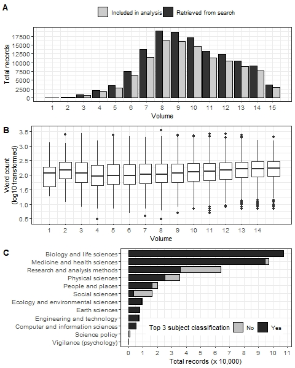
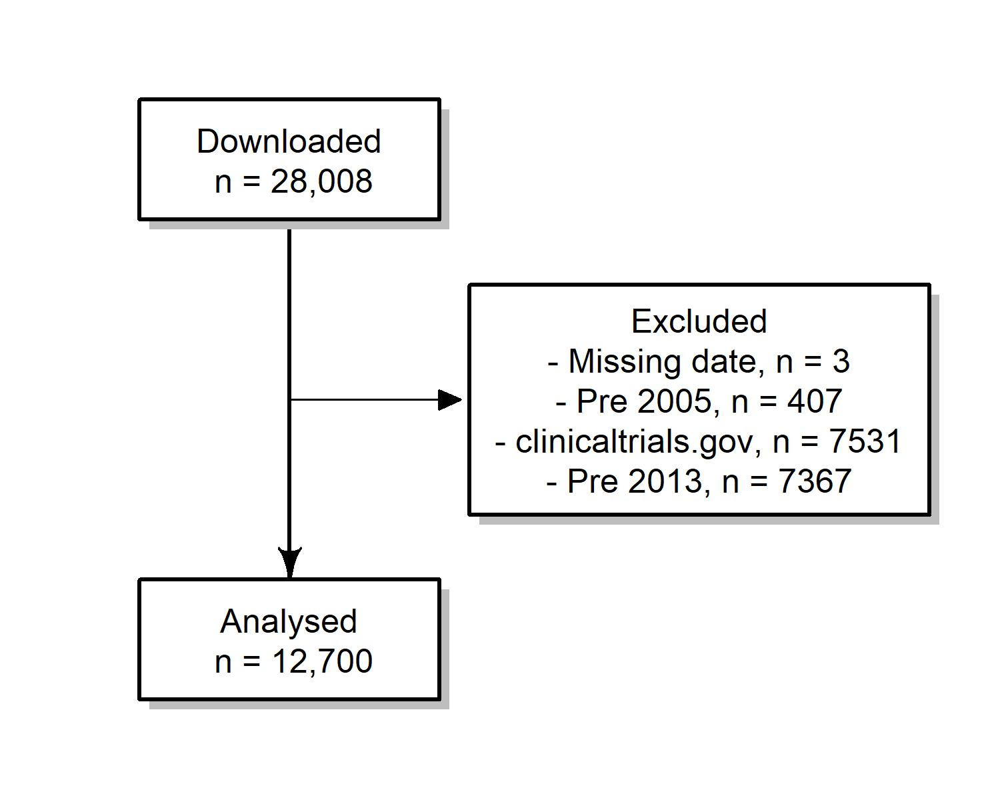
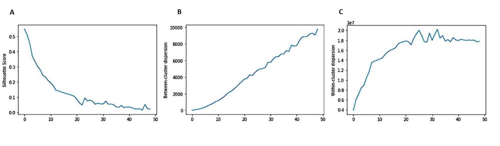
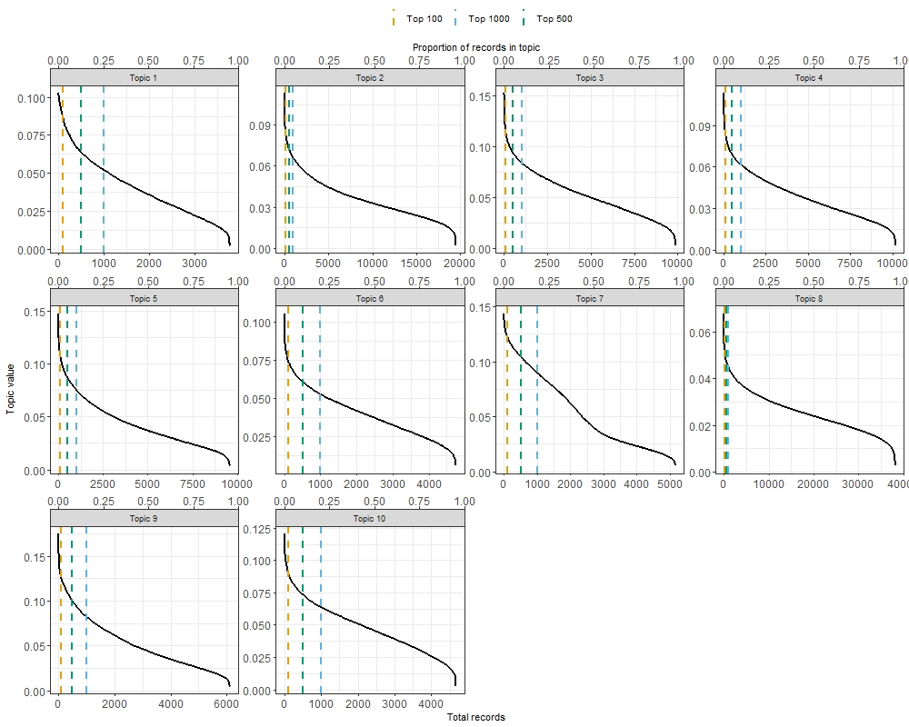
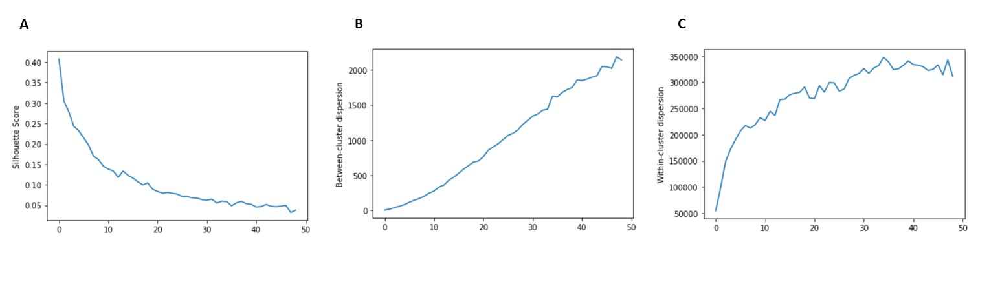
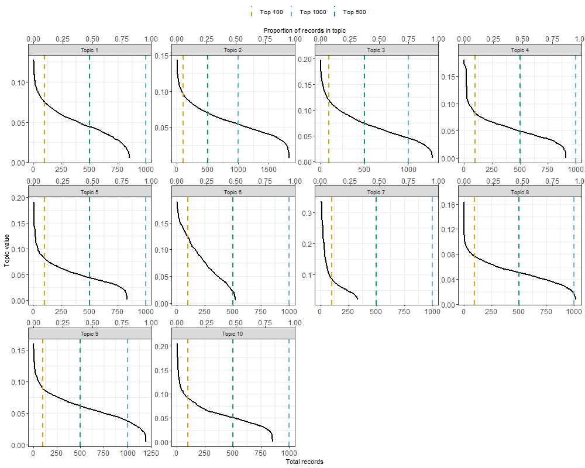

```{r setup, include=FALSE}
knitr::opts_chunk$set(echo = FALSE)
library(tidyverse)
library(ggpubr)
library(knitr)
library(flextable)
library(tidytext)

g.theme = theme_bw()+theme(legend.position = 'top',legend.direction = 'horizontal')
```

# Introduction

An ideal statistical analysis will use appropriate methods to create insights from the data and inform the research questions. Unfortunately many current statistical analyses are far from ideal, with many researchers using the wrong methods, misinterpreting the results, or failing to adequately check their assumptions [@2008;@Leek2017]. Some researchers take a "mechanistic" approach to statistics, copying the few methods they know regardless of their appropriateness, and then going through the motions of the analysis [@Stark2018]. 

Many researchers lack adequate training in research methods, and statistics is something they do with trepidation and even ignorance [@Altman1994;@King2019]. 
However, using the wrong statistical methods can cause real harm [@Altman1994;@Brown2018] and bad statistical practices are being to used abet weak science [@Stark2018].
Statistical mistakes are a key source of waste in research and partly explain the current reproducibility crisis in science [@Allison2016]. Even when the correct methods are used, many researchers fail to describe them adequately, making it difficult to reproduce the results [@Ernst2017;@Zhou2018].
Poor statistical methods might not be caught by reviewers, as they may not be qualified to judge the statistics.
A recent survey of editors found that only 23% of health and medical journals used expert statistical review for all articles [@Hardwicke2020], which was little different from a survey from 22 years ago [@Goodman1998].

There is guidance for researchers on how to write up their statistical methods and results.
The International Committee of Medical Journal Editors recommend that researchers should: “Describe statistical methods with enough detail to enable a knowledgeable reader with access to the original data to judge its appropriateness for the study and to verify the reported results” [@ICMJE2019]. 
More detailed guideance is given by the SAMPL and EQUATOR guidelines [@Lang2013;@Altman2016] with the latter covering all apsects of the paper. Both of these guidelines were led by Doug Altman, who spoke often and for many years about the need for better statistical reporting. 
The awareness and use of these guidelines could be improved. There were 256 Google Scholar citations to the SAMPL paper (as at 15 March 2021) which is a good citation statistic for most papers, but is low considering the millions of papers that use statistical analysis.

Two statisticians on this paper (AB and NW) have heard researchers admit that they have copied-and-pasted their statistical methods sections from other papers, regardless of whether they are appropriate. 
The aim of this paper is to use text-mining methods to estimate the extent that researchers are using cut-and-paste or 'boilerplate' statistical methods sections.
Boilerplate text is that "which can be reused in new contexts or applications without significant changes to the original" [@Wikipedia].
Use of these methods sections indicates that little thought has gone into the statistical analysis.


# Methods

\subsection{Data sources}

We used two openly available data sources to find statistical methods sections: research articles published in _PLOS ONE_ and study protocols registered on the Australian and New Zealand Clinical Trials Registry (ANZCTR). Data sources were chosen as examples of common research outputs that include descriptions of statistical methods that were used, or are planned, for analysing study outcomes.

\subsubsection{Public Library of Science (PLOS ONE)}
\label{sec:methodsPLOS}

_PLOS ONE_ is a large open access journal that publishes original research across a wide range of scientific fields. Articles must be in English. Article submissions are handled by an academic editor who selects peer reviewers based on their self-nominated areas of expertise. Submissions do not undergo formal statistical review. Instead, reviewers are required to assess submissions against several publication criteria, including whether: “Experiments, statistics, and other analyses are performed to a high technical standard and are described in sufficient detail” [@PLOS]. All reviewers are asked the question: "Has the statistical analysis been performed appropriately and rigorously?", with the possible responses of "Yes", "No" and "I don't know".

Authors are encouraged to follow published reporting guidelines such as EQUATOR, to ensure that chosen statistical methods are appropriate for the study design, and adequate details are provided to enable independent replication of results. 

All _PLOS ONE_ articles are freely accessible via the PLOS Application Programming Interface (API). This enabled us to conduct searches of full-text articles and analyse data on articles' text content and general attributes such as publication date and field(s) of research. To find papers with a statistical methods section we used targeted API searches followed by article filtering based on section headings. The data were downloaded on 3 July 2020.

_Step 1_: Targeted API searches. API searches were completed using the R package ‘rplos’ [@rplos]. Search queries targeted the presence of analysis-related terms anywhere in the article. Search terms combined the words “data” or “statistical” with one of: “analysis”, “analyses”, “method”, “methodology” or “model(l)ing”. Search terms were intended to be broad whilst keeping search results to a manageable number for full-text review (see Step 2). By allowing terms to appear anywhere in the article, we accounted for the possibility of relevant text being placed in different sections, for example, in the _Material and Methods_ section versus _Results_. Search results were indexed by a unique Digital Object Identifier (DOI). Attribute data collected per DOI included journal volume and subject classification(s).

_Step 2_: Partial matching on section headings. Full text XML data for all search results were downloaded and combined into a single dataset, organised by DOI and subsection heading(s). Since _PLOS ONE_ does not prescribe standardised headings to preface statistical methods sections, we performed partial matching on available headings against frequently used terms in initial search results: ‘Statistical analysis’, ‘Statistical analyses’, ‘Statistical method’, ‘Statistics’, ‘Data analysis’ and ‘Data analyses’. For records that did not pass this second stage filter, we selected a random sample of XXX records and reviewed where initial search terms appeared in the full-text, to estimate the likely proportion of statistical methods sections that were missed.

<!-- For records that did not pass this second stage filter, we reviewed where keywords appeared in the full-text to ascertain the extent of missing statistical analysis sections. ...[TODO: finish this whilst draft is with coauthors]-->


\subsubsection{Australia and New Zealand Clinical Trials Registry (ANZCTR)}
\label{sec:methodsANZCTR}

The ANZCTR was established in 2005 as part of a coordinated global effort to improve research quality and transparency in clinical trials reporting; observational studies can also be registered. All studies registered on ANZCTR are publicly available and can be searched via an online portal (https://www.anzctr.org.au). 

Details required for registration follow a standardised template [@ANZCTR], which covers participant eligibility, the intervention(s) being evaluated, study design and outcomes. The information provided must be in English. Studies are not peer reviewed. 

For the statistical methods section, researchers are asked to provide a "brief description" of the sample size calculations, statistical methods and planned analyses, although this section is not compulsory [@ANZCTR]. Studies are reviewed by ANZCTR staff for completeness of key information, which does not include the completeness of the statistical methods sections. 

All studies available on ANZCTR were downloaded on 1 February 2020 in XML format. 
We used all the text available in the "Statistical methods" section. We also collated basic information about the study including the study type (interventional or observational), submission date, number of funders and target sample size. These variables were chosen as we believed they might influence the completeness of the statistical methods section, because we expected larger studies and those with funding to be more complete, and we also were interested in changes over time.

Studies prior to 2013 were excluded as the statistical methods section appeared to be introduced in 2013.
Some studies were first registered on the alternative trial database _clinicaltrials.gov_ and then also posted to ANZCTR. We excluded these studies because they almost all had no completed statistical methods section as this section is not included in _clinicaltrials.gov_.

\subsection{Full-text processing}
\label{sec:methods-cleaning}

We applied the same text cleaning to both data sources. 
Text cleaning aimed to standardise notation and statistical terminology, whilst minimising changes to article style and formatting. _R_ code used for data extraction and cleaning is available from https://github.com/agbarnett/stats_section.

Mathematical notation including Greek letters was converted from Unicode characters to plain text. For example, the Unicode characters corresponding to $\theta$ (<U+03B8>) were replaced with ‘theta’. Similarly, common symbols outside of Unicode blocks including ‘%’ (percent) and ‘<’ (‘less-than’) were converted into plain text using the ‘textclean’ package [@textclean]. General formatting was removed, this included carriage returns, punctuation marks, in-text references (e.g. "[42]") centred equations, and other non-ASCII characters. Text contained inside brackets was retained to maximise content for analysis, with brackets removed.

We compiled an extensive list of statistical terms to standardise descriptions of statistical methods reported across both datasets. An initial list was compiled by calculating individual word frequencies and identifying relevant terms that appeared at least 100 times. Further terms were sourced from index searches of three statistics textbooks [@Dobson2018,@Diggle2013,@Bland2015]. The final list is provided as Supplementary Material. Plurals (e.g., ‘chi-squares’) unhyphenated (e.g., ‘chi square’) and combined (e.g. ‘chisquare’) terms were transformed to singular, hyphenated form (e.g., ‘chi-square’). Common statistical tests were also hyphenated (e.g., ‘hosmer lemeshow’ to ‘hosmer-lemeshow’).

As a final step, common stop words including pronouns, contractions and selected prepositions were removed. We retained selected stop words that, if excluded, may have changed the context of statistical methods being described, for example ‘between’ and ‘against’.

<!-- Questions: -->

<!-- * Reference updates to stats reporting guidelines; e.g see: -->

<!-- - https://everyone.plos.org/2019/09/26/new-plos-one-statistical-reporting-guidelines/. -->
<!-- - https://web.archive.org/web/20190607174803/https://journals.plos.org/plosone/s/submission-guidelines -->
<!-- - https://web.archive.org/web/20150507175314/https://journals.plos.org/plosone/s/submission-guidelines -->


\subsection{Clustering algorithm}

_Details to come_

We applied the clustering algorithm to the cleaned dataset, varying the number of clusters from 1 to 50.

Results were transformed to lower case for the clustering, but examples are given using the original capitalisation.

For each dataset, records assigned to invididual clusters were examined for evidence of boilerplate text in two ways. We first reviewed the top ten results that represented the strongest matches to each cluster. Records assigned to the same cluster were also compared by calculating pairwise cosine similarities; higher scores denoted a higher degree of similarity in text between a pair of records.

\subsection{Missing statistical methods sections}

The statistical methods section for the ANZCTR data was missing for some studies and we examined if there were particular studies where this section was more likely to be missing. 
We used four independent variables of date, study type (observational or interventional), number of funders and target sample size. 
We used a logistic regression model fitted using a Bayesian paradigm. A small number of sections were labelled as "Not applicable", "Nil" or "None" and we changed these to missing. 


# Results

## _PLOS ONE_

```{r}
load('../../results/total.records.plos.rda')
n.api = total.records[[1]] %>% filter(stage=='API') %>% pull(n) %>% sum()
n.include = total.records[[1]] %>% filter(stage=='Included in analysis') %>% pull(n) %>% sum()
perc.include = round(100*n.include/n.api)
min.perc.stats = total.records[[2]] %>% filter(percentage==min(percentage)) %>% select(volume,percentage)
max.perc.stats = total.records[[2]] %>% filter(percentage==max(percentage)) %>% select(volume,percentage)
```

```{r}
load('../../results/wordcount.plos.rda')
n.words = wordcounts %>% summarise(med = median(words),q1=quantile(words,.25),q3=quantile(words,.75))
p.extremes = wordcounts %>% summarise(morethan500 = round(100*mean(words>500)),lessthan50=round(100*mean(words<50)))
n.extremes = wordcounts %>% summarise(morethan500 = sum(words>500),lessthan50=sum(words<50))
```

```{r, echo=FALSE, fig.align='center', out.width="70%",fig.cap="\\label{fig:plos-n}PLOS summary"}


```

<!--  -->


```{r}

load('../../results/stats_section_subject.classifications.rda')
stats_section_subject = mutate(stats_section_subject,
                               top3 = ifelse(subject_level_number %in% 1:3,1,0))

to_plot = stats_section_subject %>% group_by(subject_level_name) %>% summarise(n=n(),Yes=sum(top3),No=sum(top3==0),.groups='drop')

n.top3 = to_plot %>% filter(n==Yes)
n.biology = to_plot %>% filter(subject_level_name=='Biology and life sciences') %>% pull(n)
n.earth = to_plot %>% filter(subject_level_name=='Earth sciences') %>% pull(n)
n.computer = to_plot %>% filter(subject_level_name=='Computer and information sciences') %>% pull(n)

```


API searches returned `r format(n.api,big.mark=',')` unique records, of which `r format(n.include,big.mark=',')` (`r perc.include`%) included a statistical methods section based on our search strategy. In the final sample, 95,518 (85%) DOIs returned an exact match against common section headings, including 64,133 for 'statistical analysis', 13,380 for 'statistical analyses' and 13,627 for 'data analysis'. Among DOIs that did not meet the partial matching criteria, initial search terms appeared in [TODO].


Search results varied by journal volume (Figure \ref{fig:plos-n}A). The total number of API search results peaked at volumes 8 (n = `r format(total.records[[2]] %>% filter(volume==8) %>% pull(API),big.mark=',')`) and 9 (n = `r format(total.records[[2]] %>% filter(volume==8) %>% pull(API),big.mark=',')`), corresponding to years 2013 and 2014. This trend aligned with the total number of papers published in _PLOS ONE_ over the same period. The percentage of records that included a statistical methods section by volume based on our proposed matching criteria varied between `r round(min.perc.stats[['percentage']])`% (volume `r min.perc.stats[['volume']]`) and `r round(max.perc.stats[['percentage']])`% (volume `r max.perc.stats[['volume']]`).

The median length of statistical methods sections was `r n.words[['med']]` words (IQR: `r n.words[['q1']]` to `r n.words[['q3']]` words) (Figure \ref{fig:plos-n}B). `r format(n.extremes[['morethan500']],big.mark=',')` articles (`r p.extremes[['morethan500']]`%) had a statistical methods section of 500 words or more. `r format(n.extremes[['lessthan50']],big.mark=',')` articles (`r p.extremes[['lessthan50']]`%) had a statistical methods section of 50 words or less, equal to the length of this paragraph.

All papers included Biology and life sciences (n = `r format(n.biology,big.mark=',')`), Earth sciences
(n = `r format(n.earth,big.mark=',')`) and/or Computer and information sciences (n = `r format(n.computer,big.mark=',')`) in their top 3 subject classifications
(Figure \ref{fig:plos-n}C).

```{r, echo=FALSE, fig.align='center', out.width="70%", fig.cap="\\label{fig:plos-wordclouds}PLOS ONE topic clouds."}
knitr::include_graphics("figures/plos.wordclouds.jpg")
```

Increasing the number of clusters decreased cluster quality based on global goodness-of-fit measures (Supplementary Figure 1), with average silhouette score and within-cluster dispersion leveling off around 20 clusters. This indicated that the data comprised one large, heterogeneous cluster and multiple smaller clusters.

The topic clouds based on ten clusters are in Figure~\ref{fig:plos-wordclouds}. Frequently occurring words reflected the use of statistical software (Topics 3 and 5), descriptive statistics (Topic 6), group based hypothesis testing (Topics 1 and 4) and definitions of statistical significance (Topics~1 and 9). Statistical methods sections associated with regression (Topic 2) and meta-analysis (Topic 7) were also identified. 


<!-- ```{r} -->
<!-- load('../../results/plos.results.10topics.rda') -->

<!-- ftab.plos = matches %>% -->
<!--   group_by(topic_id) %>% summarise(DOIs = n(),`Median word count` = median(words),Q1=quantile(words,.25),Q3=quantile(words,.75),.groups='drop')  -->

<!-- flextable(ftab.plos) -->

<!-- ``` -->

Topics related to the use of statistical software differentiated between Prism GraphPad (Topic~3: n = 9,879; 8.8%) and SPSS (Topic 5: n = 9,574; 8.6%) (Box 1). A manual review of the top matching sections in these topics showed strong evidence of boilerplate text. Nine out ten top matches for Topic 3 stated the use of Prism GraphPad but did not specify which statistical methods were used; six out of ten top matches returned the same cluster score indicating near identical text. Top matching sections for Topic 5 included information on SPSS version numbers and definitions of statistical significance.


* Results of cosine similaritites

```{r}
load('../../results/plos.cosinesim.10topics.rda')

ftab = flextable(ftab.cosine.plos) %>% theme_box() %>% autofit()
ftab <- set_caption(ftab, "Summary of cosine similarity scores among top 500 DOIs assigned to each topic: PLOS ONE")
ftab

```

\subsection{ANZCTR}


```{r, echo=FALSE, fig.align='center', out.width="70%", fig.cap="ANZCTR topic clouds."}
knitr::include_graphics("figures/anzctr.wordclouds.jpg")
```


We downloaded 28,008 studies. The numbers of excluded studies are shown in Figure~\ref{fig:anzctr-missing}. Of the 12,700 included studies, 9,523 (75%) had a statistical methods section. 


```{r, echo=FALSE, fig.align='center', out.width="70%", fig.cap="ANZCTR search results."}



```

The median length of the section was 129 words with an inter-quartile range of 71 to 219 words.
Some methods sections were only one word, including "ANOVA", "t-test", "SPSS" and even "SSPS". 

The clustering algorithm found groups that were purely sample size calculations (topic 2), pilot studies (topic 5), safety/tolerability studies (topic 6) and repeated measures ANOVA (topic 10). There were cases where the exact same method section had been re-used in a different study.

We also found evidence of 'boilerplate' sections clustered as topic 3, example text 

**Box x: Examples of boilerplate text from ANZCTR**

Topic 3

* "Shapiro Wilk test was used as normality test. Continuous variables were compared using Student t-test and Mann-Whitney U test when the data were not normally distributed. Categorical variables were compared using Pearson’s chi-squared test and Fisher’s exact test. Paired data were analyzed using Paired t-test and Wilcoxon signed rank test when data were not normally distributed."
* "Comparisons between categorical variables will be made either using chi square or Fisher exact test. Continuous data will be compared using the Student’s t-test or Mann-Whitney U test. Two sided p values of less than 0.05 will be considered statistically significant."


We examined if four study characteristics were associated with a missing statistics section. The odds ratios and 95% credible intervals are in Table~X. Observational studies were less likely to have a missing methods section compared with interventional studies. Missing sections became less likely over time. Studies with more funders and a larger target sample size were less likely to have a missing methods section.  

```{r}
table =  read.table(header=TRUE, sep='&', text='
Variable & Odds ratio & 95% CI
Study type = Observational & 0.78 & 0.69, 0.89
Date (per year) & 0.90 & 0.88, 0.91
Number of funders & 0.80 & 0.74, 0.86
Target sample size (per doubling) & 0.90 & 0.88, 0.92')

ftab = flextable(table) %>%
theme_box() %>%
autofit()
ftab
```


* Final sample size

# Discussion

The first line in many statistical analysis sections in _PLOS ONE_ was the software used and some entire sections in ANZCTR only stated the software, implying that the software is the most important detail. As Doug Altman said, "Many people think that all you need to do statistics is a computer and appropriate software" [@Altman1994]. This is far from the truth, and whilst it is important for researchers to mention the software and version used for reproducibility purposes, it is a minor detail compared with detailing what methods were used and why.

A frequent theme in the boilerplate statistical methods is the definition of statistical significance, nearly always using a p-value at the 5% level. This widespread use of statistical significance is troubling giving the bright-line thinking it engenders [@McShane2019] and the common misinterpretations of p-values [@Goodman2008].

Despite the extensive array of statistical tests available, many authors are reporting the same few methods.

One reason these inadequate sections get published is that most journals do not use statistical reviewers, despite empirical evidence showing they improve manuscript quality [@Hardwicke2020]. 

A related paper has criticised vague statistical methods sections because they deprive readers and reviewers for the opportunity to confirm that the appropriate methods were used [@Weissgerber2018]. These authors checked hundreds of papers using ANOVA and found that 95\% did not contain the information needed to determine what type of ANOVA was performed. This lack of information could well be because the authors used a boilerplate statistical methods section that was missing key details.

If authors shared their code then this would provide an alternative route for checking what statistical methods were used. This is not a perfect solution, as we still want authors to accurately report their methods, but it does increase transparency. However, a recent paper found that code sharing was very low in biomedical papers, with just 2\% of a sample of over 6,000 papers sharing code [@Serghiou2021].

Many researchers are using lazy practice by copying a standard "boilerplate" statistical methods section, likely cut-and-pasting from other researchers or projects. This is a strong sign of the ritualistic practice of statistics where researchers go through the motions rather than using conscientious practice [@Stark2018]. This is concerning because using the wrong statistical methods can reduce the value of study, or worse, invalidate the entire study. These mistakes are avoidable and are wasting of thousands of hours of researchers' time and the time of patients and volunteers. Poor statistical practice is a key driver of the ongoing reproducibility crisis in science [@Ioannidis2014].

## Limitations

We did not check whether papers used the correct methods, and for some simple studies a 'boilerplate' statistical methods might be adequate.

We examined papers where there was a statistics section, and we missed papers that used statistical analysis but did not include a statistical analysis section. Reiterate outcomes of random sample checking here.

We only examined one large journal and one trial registry and hence our results may not be generalisable to all journals or registries, especially those that consistently use a statistical reviewer.

We searched the full text of _PLOS ONE_ papers but not the supporting information which may contain statistical methods sections for some papers. The search terms we used to find statistical methods appeared in the supporting information titles for xxx papers (x%). We did not include the supporting information because it is less structured than the paper and could be in PDF or Word format.


\section{Supplementary}

\subsection{PLOS}


```{r, echo=FALSE, fig.align='center', out.width="100%", fig.cap="PLOS ONE clustering metrics."}

```


```{r, echo=FALSE, fig.align='center', out.width="100%", fig.cap="PLOS ONE topic values."}

```

\subsection{ANZCTR}

```{r, echo=FALSE, fig.align='center', out.width="100%", fig.cap="ANZCTR clustering metrics."}

```


```{r, echo=FALSE, fig.align='center', out.width="100%", fig.cap="ANZCTR topic values."}

```

