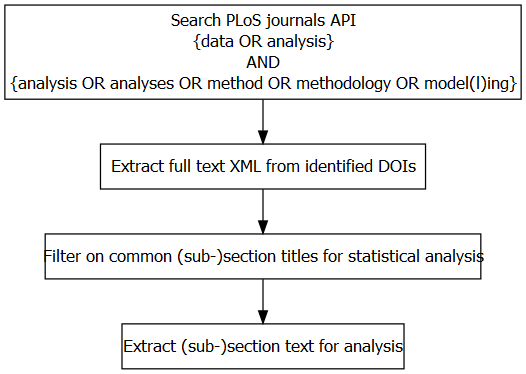

```{r setup, include=FALSE}
knitr::opts_chunk$set(echo = TRUE)
library(dplyr)
library(tidyr)
library(pander)
library(ggplot2)
panderOptions('table.emphasize.rownames', FALSE)
panderOptions('keep.trailing.zeros', TRUE)
panderOptions('table.split.table', Inf)
panderOptions('table.split.cells', Inf)
panderOptions('big.mark', ',')
panderOptions('table.emphasize.rownames', FALSE)
panderOptions('keep.trailing.zeros', TRUE)
panderOptions('table.split.table', Inf)
panderOptions('table.split.cells', Inf)
panderOptions('big.mark', ',')
panderOptions('keep.line.breaks', TRUE)
panderOptions('table.alignment.default','left')
```

An ideal statistical analysis will use appropriate methods to create insights from the data and inform the research questions. Unfortunately many current statistical analyses are far from ideal, with many researchers using the wrong methods, misinterpreting the results, or failing to adequately check their assumptions [@Goodman2008;@Leek2017]. Some researchers take a "mechanistic" approach to statistics, copying the few methods they know regardless of their appropriateness, and then going through the motions of the analysis [@Stark2018]. 

Many researchers may not have received adequate training in research methods, and statistics is something they do with trepidation and even ignorance [@Altman1994;@King2019]. 
However, using the wrong statistical methods can cause real harm [@Altman1994] and bad statistical practices are being to used abet weak science [@Stark2018].
Statistical mistakes are a key source of waste in research and partly explain the current reproducibility crisis in science [@Allison2016]. Even when the correct methods are used, many researchers fail to describe them adequately, making it difficult to reproduce the results [@Ernst2017;@Zhou2018].

The International Committee of Medical Journal Editors recommend that researchers should: “Describe statistical methods with enough detail to enable a knowledgeable reader with access to the original data to judge its appropriateness for the study and to verify the reported results” [@ICMJE2019]. Although the general lack of statistical understanding from both authors and reviewers means this recommendation may not be checked.
A recent survey of editors found that only 23% of health and medical journals used expert statistical review for all articles [@Hardwicke2020], which was little different from a survey from 22 years ago [@Goodman1998].

As statisticians we have heard researchers admit that they sometimes copy-and-paste their statistical methods sections from other papers, regardless of whether they are appropriate. 
The aim of this paper is to use text-mining methods to estimate the extent that researchers are using 'boilerplate' statistical methods sections.
Use of these methods sections indicates that little thought has gone into the statistical analysis.


# Methods

## Data source

We chose _PLOS ONE_ because it is a large multi-disciplinary open access journal, and because the journal laudibly make the full text of papers easily available for analysis via an API. This enabled us to isolate the statistical analysis section of the paper, and also collect descriptive data on the paper (e.g., field of research).

<!--- https://journals.plos.org/plosone/s/editorial-and-peer-review-process --->
<!--- https://journals.plos.org/plosone/s/criteria-for-publication --->
The criteria for publication include, "Experiments, statistics, and other analyses are performed to a high technical standard and are described in sufficient detail".
_PLOS ONE_ does not use a separate statistical peer reviewer. Articles are handled by an academic editor who selects peer reviewers. 
_PLOS ONE_ expect authors to use reporting guidelines from the EQUATOR network, which were designed in part because of the long history of poor statistical application and reporting in health and medical journals [@Altman2016].

We used the 'rplos' package to read the data from the API into R [@rplos].

Questions:

* What questions are asked of PLOS ONE Reviewers?

- Is the manuscript technically sound, and do the data support the conclusions?
- Has the statistical analysis been performed appropriately and rigorously?
- Does the manuscript adhere to the PLOS Data Policy?
- Is the manuscript presented in an intelligible fashioin and written in standard English?


* Reference updates to stats reporting guidelines; e.g see:

- https://everyone.plos.org/2019/09/26/new-plos-one-statistical-reporting-guidelines/.
- https://web.archive.org/web/20190607174803/https://journals.plos.org/plosone/s/submission-guidelines
- https://web.archive.org/web/20150507175314/https://journals.plos.org/plosone/s/submission-guidelines

## Search strategy
Our search strategy comprised targeted searches of the PLOS API and filtering of full-text articles based on section headings (Figure \ref{fig:search-strategy}). All full-text Research Articles published in _PLOS ONE_ since 2006 were eligible for inclusion.

Initial searches of the PLOS API were completed using the ‘rplos’ package [@rplos]. Submitted search queries focussed on the presence of analysis-related terms anywhere within a full-text article. Individual terms combined the words “data” or “statistical”, with one of: “analysis”, “analyses”, “method”, “methodology” or “model(l)ing”. Results terms were intended to be broad and, by allowing terms to appear anywhere within the article, we accounted for the placement of relevant text in different sections, for example, in the Material and Methods section versus Supplementary Information. Search results were indexed by Digital Object Identifier (DOI), which enabled the removal of duplicate records. Metadata collected for each DOI included journal volume, PLOS subject classification(s) and number of article views since publication.

Full-text XML data were then extracted for all search results for further processing. Data were extracted by DOI and organised by individual section and subsection headings. In order to consistently identify statistical methods sections, partial matching on commonly used sections headings was done to filter results (see Figure \ref{fig:search-strategy}). The final dataset was cleaned prior to analysis using the ‘textclean’ package [@textclean]. Cleaning steps included conversion of all text to lower case, replacement of common symbol (e.g % to ‘percent’; < to ‘less than’) and removal of punctuation and excess whitespace. Commonly used statistical methods were standardised across all records, which included changing terms from plural to singular (e.g. tukey’s to tukey) as well as hyphenated terms (e.g. “kruskal-wallis” to “kruskal wallis”).  The full list of standardised terms is provided as a Supplementary File.

## Clustering algorithm


```{r echo=F,fig.cap='\\label{fig:search-strategy}Search strategy',fig.align='center',fig.height=5}


```

# Results

```{r source, message=F,echo=F}
load('data/search_results_n.RData')
```

* total records found: 178654; 131847 unique DOIs
* total stats sections after filtering: 111731 (85%)
* Plot over time. Currently double counting if more than one search query for same doi.

```{r echo=F,fig.cap="\\label{fig:search-results-n}Figure caption here"}
plot_dat_n = n_by_searchterm_volume %>% group_by(volume) %>% 
  summarise(n_matches = sum(n_unique)) %>% right_join(.,n_by_volume %>% select(-n_records),by='volume') %>% 
  gather(variable,value,-volume)

plot_dat_n %>% ggplot(.,aes(x=volume,y=value,group=variable))+
  geom_bar(stat='identity',position='dodge',aes(fill=variable))

```

# Discussion

The first line in many statistical analysis sections was the software used, implying that the software is the most important detail. As Doug Altman said, "Many people think that all you need to do statistics is a computer and appropriate software" [@Altman1994]. This is not the case, and whilst it is important for researchers to mention the software and version used for reproducibility purposes, it is a relatively minor detail compared with detailing what methods were used and why.

Despite the extensive array of tests available, many authors are reporting the same few methods.

## Limitations

We did not check whether papers used the correct methods, and for some simple studies a 'boilerplate' statistical methods section would be fine.

We examined papers where there was a statistics section, and we missed papers that used statistical analysis but did not include a statistical analysis section. 

We only examined one journal and hence our results may not be generalisable to all journals, especially those that use a statistical reviewer for all papers.

# References

